<div align="center">



<br/>


<br/>

**Apps, stories, interfaces, ideas — I like turning things that exist in my head into things that exist in the world.**

</div>

---

## Hi — I'm Camila. Rock works too. 🪨

I'm an **iOS Developer, writer and creative person** with a habit of turning *“what if?”* into a project.

Professionally, my main playground is the Apple ecosystem. I love building iOS experiences and thinking beyond the screen itself: architecture, state, flow, words, visual consistency, edge cases and the small decisions that make something feel intentional.

But I don't only think in code.

I write stories. I care about design. I collect ideas. I rewrite things that were already “done”. And I have a suspicious talent for transforming a tiny thought into an entire side project. 😂

> **Build it. Write it. Question it. Make it better.**

---

## Three modes. Same brain.

<table>
<tr>
<td width="33%" valign="top" align="center">

### 🍎 BUILD

**iOS is home.**

Swift, architecture, interfaces, APIs, concurrency, reusable components and the never-ending search for a cleaner solution.

</td>
<td width="33%" valign="top" align="center">

### ✍🏻 WRITE

**Some ideas need chapters, not views.**

I'm writing **_Qual Desses é Verdadeiro?_**, a long-form personal project built through scenes, memories, questions and a lot of rewriting.

</td>
<td width="33%" valign="top" align="center">

### ✨ CREATE

**The format comes after the idea.**

Sometimes it's an app. Sometimes a story. Sometimes a visual concept. Usually it starts with *“okay, hear me out...”*.

</td>
</tr>
</table>

---

## 🍎 When I'm building

<div align="center">


<br/><br/>


</div>

I work mostly with **Swift, SwiftUI and UIKit**. I enjoy the point where engineering and experience meet — when good architecture makes a feature easier to evolve and good product thinking makes it nicer to use.

<details>
<summary><b>🧰 Open the toolbox</b></summary>
<br/>

**iOS**  
`Swift` · `SwiftUI` · `UIKit` · `Objective-C` · `Combine` · `async/await` · `URLSession` · `AVFoundation`

**Architecture & engineering**  
`MVVM` · `MVVM-C` · `Clean Architecture` · `REST APIs` · `Design Systems` · `Testing`

**Workflow**  
`Git` · `GitHub` · `GitHub Actions` · `Fastlane` · `Firebase`

**Occasional side quests outside Apple land**  
`React` · `TypeScript` · `JavaScript` · `HTML` · `CSS`

</details>

---

## 🚀 Currently in the lab

### 🔎 [GitHubExplorer-iOS](https://github.com/camilarock11/GitHubExplorer-iOS)

A GitHub client I'm building as part of a bigger goal: creating **substantial iOS projects that behave like real products** instead of isolated tutorial exercises.

That means caring about more than a happy-path screen: architecture, APIs, loading and error states, reusable components, failure scenarios, maintainability and all the weird little decisions that appear once an app starts becoming real.

<a href="https://github.com/camilarock11/GitHubExplorer-iOS">

</a>

---

## ✍🏻 When I'm writing

Code has rules. Stories have consequences.

**_Qual Desses é Verdadeiro?_** is the project where I explore the other side of how my brain works: scenes, people, memory, perspective and the uncomfortable question of how differently the same story can look depending on who is telling it.

Writing scratches a very different itch than development — and somehow still involves versioning, restructuring, deleting things I swore were finished and staring at one sentence for far too long. So... maybe not *that* different. 😂

---

## 🎛️ Rock OS

<details>
<summary><b>boot sequence ▸ click to open</b></summary>
<br/>

```text
rock@github:~$ whoami
Camila Roque

rock@github:~$ modes
[ BUILD ] [ WRITE ] [ CREATE ]

rock@github:~$ defaults
curiosity        = true
details          = "important"
new_ideas        = "constantly"
coffee           = false
open_tabs        = "please don't ask"
finished_project = "define finished"

rock@github:~$ status
turning another idea into something real...
█
```

</details>

---

## A few things that tend to be true

`I will notice the spacing.` · `I will ask what happens in the edge case.` · `I will rename it three times.`  
`I probably have a draft for it.` · `I like big projects.` · `I don't like coffee.` 😂

---

## 🤝 Find me around the internet

<div align="center">

<a href="https://www.linkedin.com/in/camila-roque-it-analyst-designer/">

</a>

<a href="https://instagram.com/camilarock11">

</a>

<a href="https://github.com/camilarock11">

</a>

<br/><br/>

### `build something.`
### `write something.`
### `leave it better than you found it.`

<sub>Usually powered by curiosity, stubbornness and far too many ideas. 💜</sub>

</div>
